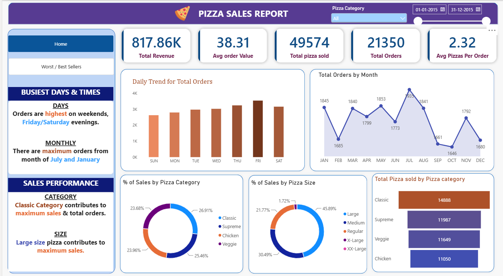
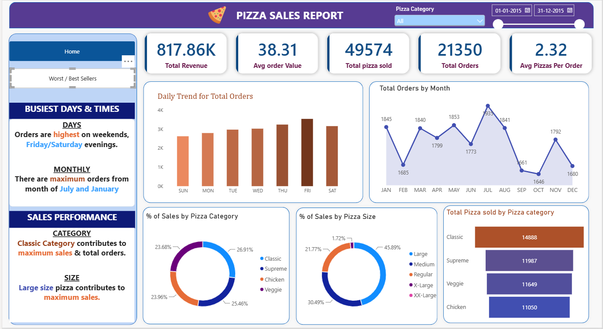

# 🍕 Pizza Sales Analysis | SQL Server & Power BI


## 📌 Project Overview

This project analyzes pizza sales data using **SQL Server** and **Microsoft Power BI** to evaluate business performance, identify sales trends, understand customer preferences, and determine the best- and worst-performing pizza products.

The project combines **SQL-based data analysis** with an interactive **Power BI dashboard** to transform raw sales data into meaningful business insights and actionable performance indicators.

---

## 🎯 Project Objectives

The main objectives of this project are to:

* Analyze overall pizza sales performance
* Develop key business performance indicators (KPIs)
* Identify daily and monthly sales trends
* Understand sales distribution across pizza categories and sizes
* Identify top-performing pizza products
* Identify underperforming pizza products
* Build an interactive Power BI dashboard for business analysis

---

## 📊 Key Performance Indicators (KPIs)

The analysis calculates the following KPIs:

| KPI                          | Description                                  |
| ---------------------------- | -------------------------------------------- |
| **Total Revenue**            | Total revenue generated from pizza sales     |
| **Average Order Value**      | Average revenue generated per order          |
| **Total Pizzas Sold**        | Total quantity of pizzas sold                |
| **Total Orders**             | Total number of orders placed                |
| **Average Pizzas per Order** | Average number of pizzas purchased per order |

---

## 📈 Dashboard Analysis

The Power BI dashboard provides insights into:

### Sales Trends

* Daily trend of total orders
* Monthly trend of total orders

### Category Analysis

* Percentage of sales by pizza category
* Total pizzas sold by pizza category

### Size Analysis

* Percentage of sales by pizza size

### Product Performance

* Top 5 pizzas by revenue
* Top 5 pizzas by quantity sold
* Top 5 pizzas by total orders
* Bottom 5 pizzas by revenue
* Bottom 5 pizzas by quantity sold
* Bottom 5 pizzas by total orders

---

## 🖥️ Power BI Dashboard

The dashboard was developed using **Microsoft Power BI Desktop**.

Since the dashboard is not published publicly, the interactive report is provided as a `.pbix` file in this repository.

### 📂 Power BI File

You can open the Power BI report from:

```text
PowerBI/Pizza_Sales_Dashboard.pbix
```

### How to View the Dashboard

1. Download or clone this repository.
2. Install **Microsoft Power BI Desktop**.
3. Open:

```text
PowerBI/Pizza_Sales_Dashboard.pbix
```

4. Refresh the data if required.
5. Interact with the dashboard using the available filters and visualizations.

---

## 🖼️ Power BI Dashboard Preview

### 🏠 Dashboard Home Page

<p align="center">
  
</p>

### 📊 Sales Report

<p align="center">
  
</p>

> **Note:** The images above provide a preview of the Power BI dashboard.  
> For the complete interactive dashboard, open the `.pbix` file in Microsoft Power BI Desktop.

📂 **Power BI File:** `PowerBi/pizza_sales_dashboard.pbix`

## 🛠️ Tools & Technologies

| Tool / Technology      | Purpose                                              |
| ---------------------- | ---------------------------------------------------- |
| **SQL Server**         | Data analysis and querying                           |
| **SQL**                | KPI calculations, aggregation, filtering and ranking |
| **Microsoft Power BI** | Interactive dashboard and visualization              |
| **DAX**                | Measures and dashboard calculations                  |

---

## 🔍 SQL Analysis

The SQL analysis covers multiple aspects of the pizza sales dataset.

### KPI Analysis

* Total Revenue
* Average Order Value
* Total Pizzas Sold
* Total Orders
* Average Pizzas Per Order

### Trend Analysis

* Daily order trends
* Monthly order trends

### Category & Size Analysis

* Revenue percentage by pizza category
* Revenue percentage by pizza size
* Total pizzas sold by category

### Product Performance

* Top 5 pizzas by revenue
* Bottom 5 pizzas by revenue
* Top 5 pizzas by quantity
* Bottom 5 pizzas by quantity
* Top 5 pizzas by total orders
* Bottom 5 pizzas by total orders

The complete SQL analysis is available at:

```text
SQL/pizza_sales_analysis.sql
```

---

## 💡 Business Questions Addressed

This project answers questions such as:

* What is the total revenue generated?
* What is the average value of an order?
* How many pizzas have been sold?
* How many orders have been placed?
* Which days have the highest order activity?
* Which months have stronger order volumes?
* Which pizza categories contribute the most to sales?
* Which pizza sizes are most popular?
* Which pizzas generate the highest revenue?
* Which pizzas have the highest sales quantities?
* Which pizzas receive the most orders?
* Which products are underperforming?

---

## 📁 Repository Structure

```text
Pizza-Sales-Analysis/
│
├── README.md
│
├── Problem-Statement/
│   └── Pizza_Sales_Problem_Statement.pdf
│
├── SQL/
│   └── pizza_sales_analysis.sql
│
├── PowerBI/
│   └── Pizza_Sales_Dashboard.pbix
│
├── Dashboard/
│   └── pizza_sales_dashboard.png
│
└── Data/
    └── README.md
```

---

## 🚀 How to Explore the Project

### 1. Clone the Repository

```bash
git clone https://github.com/anandpdt/Pizza-Sales-Analysis.git
```

### 2. Explore the SQL Analysis

Open:

```text
SQL/pizza_sales_analysis.sql
```

Run the queries in **SQL Server** against the pizza sales dataset.

### 3. Open the Power BI Dashboard

Open:

```text
PowerBI/Pizza_Sales_Dashboard.pbix
```

using **Microsoft Power BI Desktop**.

### 4. Explore the Dashboard

Use the available filters and visualizations to analyze:

* Revenue
* Orders
* Pizza quantities
* Sales trends
* Categories
* Sizes
* Top-performing products
* Bottom-performing products

---

## 📚 Skills Demonstrated

### SQL

* SQL querying
* Aggregate functions
* `GROUP BY`
* `ORDER BY`
* `COUNT(DISTINCT)`
* `SUM()`
* `CAST()`
* `WHERE`
* `TOP`
* Time-based analysis
* Ranking
* KPI calculations

### Power BI

* Data visualization
* Dashboard development
* KPI cards
* Trend analysis
* Category analysis
* Product performance analysis
* Interactive filtering
* DAX measures

### Data Analytics

* Exploratory data analysis
* Business KPI development
* Sales trend analysis
* Product performance analysis
* Business-oriented data storytelling

---

## 📌 Project Outcome

The project demonstrates how **SQL Server and Power BI can be combined to transform transactional sales data into a business intelligence solution**.

The analysis provides a structured view of sales performance, customer purchasing patterns, product performance, and sales trends, allowing businesses to identify high-performing products and areas requiring improvement.

